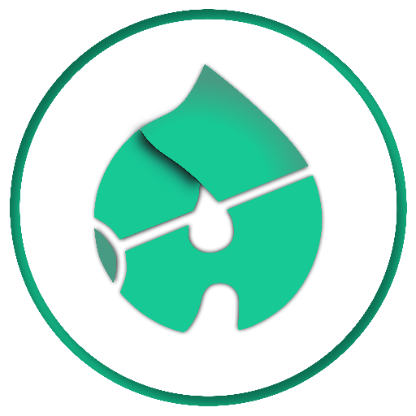

<p align="center">
  <a href="https://www.adazol.com">
    
    <h2 align="center">Adazol<span>HUB</span></h2>
  </a>
</p>


<p align="center">Hi 👋, I'm <a href="https://daniel.adazol.com">Daniel lozada</a></p>
<p align="center">A passionate full-stack developer from Philippines</p>

```bash
          |
  📕 2019 | Computer Engineering Student
          |
  💼 2020 | System Engineer (Service Desk Analyst)
          |
  🔥 2021 | Aspiring Full Stack Developer
          |
  💻 2022 | Software Engineer/Developer (Web Full-Stack)
          |
  🔥 2025 | Aspiring Software/Cloud Architect
          |
```

<p align="center"></p>

---

 ✨ Experienced in full-stack development (Typescript/Javascript, Node.js)

 🌱 I’m currently learning Generative AI, Prompt Engineering, etc.

 👀 I’m interested in Software/Cloud Architect

 💞️ I’m looking to collaborate on Web App Development

 📫 How to reach me: daniel.lozada@outlook.ph | (63) 910-728-4115 
 
 [](https://linkedin.com/in/daniel-josaphat-lozada) 


---
<!---
### Draft Websites
- [Personal Portfolio](https://daniel.adazolhub.com/introduction)
- [Pokemon API fetch](https://pokemon-cards-adazol.vercel.app/)
- [Entrepreneurs Portfolio](https://entrepreneursportfolio.com)
- [Adazolhub](https://adazolhub.com)
- [Live Group Chat](https://chat-box-adazolhub.web.app/)
- [Blog Post](https://djlozada.wordpress.com/portfolio/iv-fluid-level-indicator)
- [Todo Web App](https://todo-app-adazolhub.web.app)
- [Shopping web app (test)](https://bscpe-store.web.app)
- [Shopping web app (re-design)](https://bscpe-store-v2.web.app)
- [Adazolhub Shop (on-progress)](https://bscpe-store-beta.vercel.app)
--->
<p align="center"></p>

<h3 align="left">Languages and Tools:</h3>


<!---
adazol123/adazol123 is a ✨ special ✨ repository because its `README.md` (this file) appears on your GitHub profile.
You can click the Preview link to take a look at your changes.
--->

